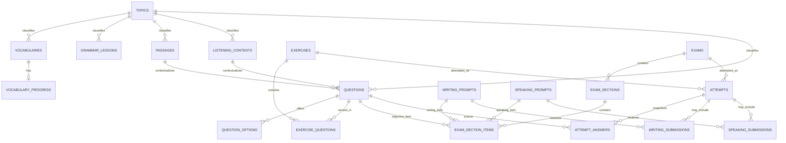

# Database Design

## Design rules

- Single-user schema: no `users`, roles, permissions, or `user_id` columns.
- Planned engine is MySQL/MariaDB on the primary host.
- Use `BIGINT UNSIGNED` IDs, UTF-8 (`utf8mb4`), Laravel timestamps, foreign keys, and explicit indexes.
- Use `VARCHAR` state/type fields plus Laravel validation instead of database enums, keeping changes and fallback migration simpler.
- Queryable metadata (skill, topic, type, difficulty, status, source category) is a column. Optional editorial tags/notes go in JSON.
- History is append-oriented. Deactivate referenced live content; do not cascade-delete attempts.
- JSON fields have documented schemas and validation; they are not unstructured dumping grounds.

## Shared conventions

Content tables use `status VARCHAR(16) DEFAULT 'draft'` with allowed application values `draft`, `active`, and `inactive`, plus `created_at` and `updated_at`.

Legally relevant content tables use these source fields:

- `source_type VARCHAR(24)` required: `original`, `public_domain`, `open_license`, `licensed`, or `personal_provided`.
- `source_reference TEXT NULL`: author/title/URL or owner note.
- `license_name VARCHAR(120) NULL` and `license_url TEXT NULL`.
- `source_notes TEXT NULL` for attribution and restrictions.

Every foreign-key column receives an index even where the table description does not repeat the word “indexed.” Content lists use targeted composites such as `(status, position)` or `(skill, status, difficulty)` only when they match a planned filter/order. Attempts use `(status, started_at)` and `(submitted_at)`; wrong-answer review uses `(attempt_id, is_correct)` after the attempt join. Unique constraints described below also create indexes. Avoid duplicate/speculative indexes and confirm them with query plans at representative volume.

## Sprint 3 implementation and production status

Sprint 3 created the nine-table assessment dependency block exactly in the documented order: `exercises`, `exercise_questions`, `writing_prompts`, `speaking_prompts`, `exams`, `exam_sections`, `exam_section_items`, `attempts`, and `attempt_answers`. The reviewed InfinityFree SQL contains no `ALTER TABLE`, `DROP`, `TRUNCATE`, destructive `DELETE`, database recreation, or reset operation. Its foreign keys, delete rules, and material unique/index constraints are the ones documented below and were re-audited in production.

Production retained the Sprint 0–2 counts: 5 topics, 3 vocabularies, 1 vocabulary-progress row, 1 grammar lesson, 1 passage, 1 listening record, 2 questions, and 5 question options. Sprint 3 added one active exercise and one exercise-question mapping. The Writing/Speaking/Exam dependency tables and their child tables are empty. The three `attempts` and three `attempt_answers` rows currently present are append-only hosted smoke-test history; they did not modify the content or vocabulary data.

## Sprint 4 implementation and production status

Sprint 4 adds no tables, columns, indexes, foreign keys, pilot content, or migration rows. Result breakdowns, History, and wrong-answer Review read the existing `attempts`, `attempt_answers`, and immutable JSON snapshots. The forward-only [Sprint 4 SQL](../database/infinityfree/sprint-4-update.sql) is intentionally comment-only, so no production SQL import is required.

## Sprint 6 implementation and production status

Sprint 6 adds only the forward-only `writing_submissions` table. Its three foreign keys use restricted deletes, and its named unique constraint protects exam-attempt/item pairs while allowing independent practice submissions with nullable attempt references. The reviewed [Sprint 6 SQL](../database/infinityfree/sprint-6-update.sql) contains no `ALTER TABLE`, destructive statement, database recreation, or reset operation.

Production verification after the one import and hosted Writing smoke flow shows 19 tables, 18 migration rows, two active original `writing_prompts`, and one submitted `writing_submissions` smoke row. The pre-existing Sprint 0–5 counts remain unchanged, including one vocabulary-progress row.

## Sprint 7 implementation and production status

Sprint 7 adds only the forward-only `speaking_submissions` table. Its three foreign keys use restricted deletes: the required `speaking_prompt_id`, plus nullable `attempt_id` and `exam_section_item_id`. The named `(attempt_id, exam_section_item_id)` unique constraint protects exam-linked manual items while nullable independent practice rows remain possible. The table stores prompt snapshots, duration, self-assessment, notes, save version, and completion time; it has no audio path, blob, or recording column.

The reviewed [Sprint 7 SQL](../database/infinityfree/sprint-7-update.sql) creates one table, records migration `2026_09_08_001900_create_speaking_submissions_table` in batch 5, and upserts three original active pilot prompts into the existing `speaking_prompts` table. It contains no executable `ALTER TABLE`, destructive statement, database recreation, or reset operation. The expected successful production state is 20 tables and 19 migration rows; the hosted rehearsal may add one metadata-only submitted row while leaving all prior content and vocabulary progress unchanged.

## Sprint 11 implementation status

Sprint 11 adds only `vocabulary_review_schedules`. It links one-to-one to the existing `vocabulary_progress` row and stores the next due time plus compact scheduler state. The migration and reviewed InfinityFree SQL do not alter, update, or delete any existing table or row. Production remains unchanged until the separate SQL/release approval gate; after an approved import the expected state is 21 tables and 20 migration rows.

## Tables

### `topics`

Purpose: shared syllabus classification.

| Column | Type / rules |
|---|---|
| `id` | BIGINT UNSIGNED PK |
| `area` | VARCHAR(24), indexed; vocabulary/grammar/reading/listening/writing/speaking/general |
| `name` | VARCHAR(120) |
| `slug` | VARCHAR(140), unique |
| `description` | TEXT NULL |
| `position` | SMALLINT UNSIGNED DEFAULT 0, index with area/status |
| `priority` | TINYINT UNSIGNED DEFAULT 2 (1 high, 2 medium, 3 low) |
| `status`, timestamps | shared fields |

Deletion is restricted while referenced; deactivate instead.

### `vocabularies`

Purpose: owner-curated vocabulary entries.

| Column | Type / rules |
|---|---|
| `id` | BIGINT UNSIGNED PK |
| `topic_id` | FK topics, required, restrict delete, indexed |
| `term` | VARCHAR(160) |
| `part_of_speech` | VARCHAR(40) NULL |
| `phonetic` | VARCHAR(120) NULL |
| `definition` | TEXT |
| `translation` | TEXT NULL |
| `example_sentence` | TEXT NULL |
| `notes` | TEXT NULL |
| `pronunciation_audio_path` | VARCHAR(500) NULL |
| source fields | required source category; other fields nullable |
| `status`, timestamps | shared fields |

Unique candidate: `(topic_id, term, part_of_speech)`; because nullable uniqueness differs by database, also validate duplicates in the application.

### `vocabulary_progress`

Purpose: current lightweight review state; detailed quiz performance remains in attempts.

| Column | Type / rules |
|---|---|
| `id` | BIGINT UNSIGNED PK |
| `vocabulary_id` | FK vocabularies, unique, cascade delete only when the unused vocabulary itself can be deleted |
| `state` | VARCHAR(16) DEFAULT `new` |
| `correct_count`, `incorrect_count` | INT UNSIGNED DEFAULT 0 |
| `last_reviewed_at` | TIMESTAMP NULL |
| timestamps | standard |

### `vocabulary_review_schedules`

Purpose: deterministic next-review scheduling for the existing single-owner vocabulary progress row.

| Column | Type / rules |
|---|---|
| `id` | BIGINT UNSIGNED PK |
| `vocabulary_progress_id` | FK vocabulary_progress, unique, cascade only when its parent progress row is deleted |
| `due_at` | TIMESTAMP, indexed |
| `interval_days` | SMALLINT UNSIGNED DEFAULT 0; `0` represents the ten-minute relearning step |
| `streak`, `lapses` | INT UNSIGNED DEFAULT 0 |
| `last_rating` | VARCHAR(8) NULL; application values `again`, `hard`, `good`, `easy` |
| timestamps | standard |

No historical content or progress row is backfilled or rewritten. Existing `learning`/`review` progress without a schedule enters the queue as legacy due work; `new` or untracked active vocabulary is capped at five cards per queue.

### `grammar_lessons`

Purpose: structured explanations and examples.

| Column | Type / rules |
|---|---|
| `id` | BIGINT UNSIGNED PK |
| `topic_id` | FK topics, required, restrict delete, indexed |
| `title`, `slug` | VARCHAR(180), slug unique |
| `objectives` | TEXT |
| `prerequisites` | TEXT NULL |
| `body` | LONGTEXT; trusted-owner Markdown/structured text |
| `examples` | JSON NULL, validated list of example/explanation pairs |
| `common_mistakes` | TEXT NULL |
| `position` | SMALLINT UNSIGNED DEFAULT 0 |
| source fields | as above |
| `status`, timestamps | shared fields |

### `passages`

Purpose: Reading context reusable by questions.

| Column | Type / rules |
|---|---|
| `id` | BIGINT UNSIGNED PK |
| `topic_id` | FK topics, NULL allowed, null on topic delete only before use; application otherwise deactivates |
| `title` | VARCHAR(200) |
| `body` | LONGTEXT |
| `word_count` | SMALLINT UNSIGNED; calculated server-side |
| `cefr_level` | VARCHAR(4) DEFAULT `B1` |
| `difficulty` | TINYINT UNSIGNED DEFAULT 2 |
| source fields | as above |
| `status`, timestamps | shared fields |

### `listening_contents`

Purpose: Listening context, transcript, and file metadata.

| Column | Type / rules |
|---|---|
| `id` | BIGINT UNSIGNED PK |
| `topic_id` | FK topics NULL, indexed |
| `title` | VARCHAR(200) |
| `transcript` | LONGTEXT |
| `audio_path` | VARCHAR(500) |
| `audio_mime` | VARCHAR(100) |
| `audio_size_bytes` | BIGINT UNSIGNED |
| `duration_seconds` | SMALLINT UNSIGNED NULL |
| `speaker_count` | TINYINT UNSIGNED NULL |
| `accent_notes` | VARCHAR(255) NULL |
| `cefr_level`, `difficulty` | as passages |
| source fields | as above |
| `status`, timestamps | shared fields |

The database stores no binary audio.

### `questions`

Purpose: reusable objective items.

| Column | Type / rules |
|---|---|
| `id` | BIGINT UNSIGNED PK |
| `topic_id` | FK topics NULL, indexed |
| `passage_id` | FK passages NULL, restrict delete, indexed |
| `listening_content_id` | FK listening_contents NULL, restrict delete, indexed |
| `skill` | VARCHAR(24), indexed |
| `type` | VARCHAR(32), indexed |
| `prompt` | LONGTEXT |
| `explanation` | LONGTEXT NULL |
| `answer_config` | JSON NULL; type-specific secret key/configuration |
| `cefr_level` | VARCHAR(4) DEFAULT `B1`, indexed with skill/status |
| `difficulty` | TINYINT UNSIGNED DEFAULT 2, indexed |
| `metadata` | JSON NULL for tags, subskills, editorial notes |
| source fields | as above |
| `status`, timestamps | shared fields |

Constraint: at most one of `passage_id` and `listening_content_id` is non-null. Context skill must match at application level. Delete is restricted once mapped or attempted.

### `question_options`

Purpose: ordered choices and objective key for choice-based items.

| Column | Type / rules |
|---|---|
| `id` | BIGINT UNSIGNED PK |
| `question_id` | FK questions, cascade only when an unused question is deleted, indexed |
| `option_key` | VARCHAR(20); stable within a question |
| `content` | TEXT |
| `is_correct` | BOOLEAN DEFAULT false |
| `position` | SMALLINT UNSIGNED |
| timestamps | standard |

Unique `(question_id, option_key)` and `(question_id, position)`. Activation validation enforces exactly one correct option for `single_choice`/`true_false`.

### `exercises`

Purpose: reusable, relatively short practice sets.

| Column | Type / rules |
|---|---|
| `id` | BIGINT UNSIGNED PK |
| `topic_id` | FK topics NULL, indexed |
| `title` | VARCHAR(200) |
| `skill` | VARCHAR(24), indexed |
| `instructions` | TEXT NULL |
| `difficulty` | TINYINT UNSIGNED DEFAULT 2 |
| `time_limit_seconds` | INT UNSIGNED NULL |
| `metadata` | JSON NULL |
| `status`, timestamps | shared fields |

### `exercise_questions`

Purpose: many-to-many ordered exercise composition.

| Column | Type / rules |
|---|---|
| `id` | BIGINT UNSIGNED PK |
| `exercise_id` | FK exercises, cascade delete when unused, indexed |
| `question_id` | FK questions, restrict delete, indexed |
| `position` | SMALLINT UNSIGNED |
| `points` | DECIMAL(6,2) DEFAULT 1.00 |

Unique `(exercise_id, question_id)` and `(exercise_id, position)`.

### `exams`

Purpose: mock-exam definition, distinct from exercises.

| Column | Type / rules |
|---|---|
| `id` | BIGINT UNSIGNED PK |
| `title` | VARCHAR(200) |
| `format_label` | VARCHAR(32): `vstep_simulation` or `general_b1` |
| `description`, `instructions` | TEXT NULL |
| `time_limit_seconds` | INT UNSIGNED NULL for an overall cap |
| `metadata` | JSON NULL; version/format notes, never invented official rules |
| `status`, timestamps | shared fields |

### `exam_sections`

Purpose: ordered skill sections with optional section deadlines.

| Column | Type / rules |
|---|---|
| `id` | BIGINT UNSIGNED PK |
| `exam_id` | FK exams, cascade when unused, indexed |
| `skill` | VARCHAR(24) |
| `title` | VARCHAR(160) |
| `instructions` | TEXT NULL |
| `position` | SMALLINT UNSIGNED |
| `time_limit_seconds` | INT UNSIGNED NULL |
| `navigation_mode` | VARCHAR(24) DEFAULT `free_within_section` |

Unique `(exam_id, position)`.

### `exam_section_items`

Purpose: one ordered list that can contain objective questions and, later, Writing/Speaking prompts without a generic polymorphic foreign key.

| Column | Type / rules |
|---|---|
| `id` | BIGINT UNSIGNED PK |
| `exam_section_id` | FK exam_sections, cascade when unused, indexed |
| `question_id` | FK questions NULL, restrict delete |
| `writing_prompt_id` | FK writing_prompts NULL, restrict delete |
| `speaking_prompt_id` | FK speaking_prompts NULL, restrict delete |
| `position` | SMALLINT UNSIGNED |
| `points` | DECIMAL(6,2) DEFAULT 1.00 |

Exactly one item FK must be non-null; unique `(exam_section_id, position)`. Migration order therefore creates prompt tables before this table.

### `attempts`

Purpose: one exercise or exam run, including objective and optional manual-production items.

| Column | Type / rules |
|---|---|
| `id` | BIGINT UNSIGNED PK |
| `exercise_id` | FK exercises NULL, restrict delete, indexed |
| `exam_id` | FK exams NULL, restrict delete, indexed |
| `status` | VARCHAR(20) DEFAULT `in_progress`, indexed |
| `completion_reason` | VARCHAR(20) NULL; `manual` or `deadline` when submitted |
| `started_at`, `expires_at`, `submitted_at` | TIMESTAMP; latter two nullable |
| `score_awarded`, `max_score` | DECIMAL(8,2) DEFAULT 0 |
| `percentage` | DECIMAL(5,2) NULL |
| `correct_count`, `incorrect_count`, `unanswered_count`, `ungraded_count` | INT UNSIGNED DEFAULT 0 |
| `duration_seconds` | INT UNSIGNED NULL |
| `configuration_snapshot` | JSON; target title, ordered sections, time rules, scoring version |
| timestamps | standard |

Exactly one of `exercise_id` and `exam_id` must be non-null. No `user_id`. The target cannot be deleted while history exists.

### `attempt_answers`

Purpose: both the immutable question occurrence and mutable response for an attempt. Rows are pre-created at start.

| Column | Type / rules |
|---|---|
| `id` | BIGINT UNSIGNED PK |
| `attempt_id` | FK attempts, cascade only if an explicit whole-attempt purge is ever approved, indexed |
| `question_id` | FK questions, restrict delete, indexed |
| `section_position`, `question_position` | SMALLINT UNSIGNED NULL/required as applicable |
| `question_snapshot` | JSON: type, prompt, option keys/text, correct keys/config, explanation, source label |
| `context_snapshot` | JSON NULL: passage/transcript metadata/body and immutable audio reference/checksum |
| `response` | JSON NULL; selected stable keys or typed response |
| `answered_at` | TIMESTAMP NULL |
| `is_correct` | BOOLEAN NULL until objective submission; NULL for manual types |
| `points_awarded` | DECIMAL(6,2) NULL |
| `max_points` | DECIMAL(6,2) |
| `save_version` | INT UNSIGNED DEFAULT 0 for stale-request control |
| timestamps | standard |

Unique `(attempt_id, question_id)` for the planned rule that a question appears at most once in a target. If repetition is later required, replace it with unique `(attempt_id, section_position, question_position)` before content uses repetition.

### `writing_prompts`

Purpose: VSTEP-style or general B1 writing tasks.

| Column | Type / rules |
|---|---|
| `id` | BIGINT UNSIGNED PK |
| `topic_id` | FK topics NULL |
| `task_type` | VARCHAR(32), e.g. email/letter/essay |
| `title`, `instructions` | VARCHAR(200), LONGTEXT |
| `minimum_words`, `recommended_minutes` | SMALLINT UNSIGNED NULL |
| `guidance`, `checklist`, `model_answer` | LONGTEXT/JSON NULL |
| source fields | as above |
| `status`, timestamps | shared fields |

### `writing_submissions`

Purpose: draft and submitted writing history.

| Column | Type / rules |
|---|---|
| `id` | BIGINT UNSIGNED PK |
| `writing_prompt_id` | FK prompts, restrict delete, indexed |
| `attempt_id` | FK attempts NULL, restrict delete, indexed |
| `exam_section_item_id` | FK item NULL, restrict delete |
| `status` | VARCHAR(16) DEFAULT `draft` |
| `response_text` | LONGTEXT |
| `word_count` | SMALLINT UNSIGNED DEFAULT 0 |
| `self_check` | JSON NULL |
| `prompt_snapshot` | JSON |
| `save_version` | INT UNSIGNED DEFAULT 0 for stale-draft control |
| `submitted_at` | TIMESTAMP NULL |
| timestamps | standard |

No automatic score in MVP. For an exam item, `attempt_id` and `exam_section_item_id` are both required and the pair is unique; independent practice leaves both null and may create multiple submissions.

### `speaking_prompts`

Purpose: VSTEP speaking parts and general B1 speaking prompts.

| Column | Type / rules |
|---|---|
| `id` | BIGINT UNSIGNED PK |
| `topic_id` | FK topics NULL |
| `part_type` | VARCHAR(32): social interaction/solution discussion/topic development/general |
| `title`, `instructions` | VARCHAR(200), LONGTEXT |
| `preparation_seconds`, `speaking_seconds` | SMALLINT UNSIGNED NULL |
| `suggested_ideas`, `follow_up_questions`, `checklist` | JSON NULL |
| source fields | as above |
| `status`, timestamps | shared fields |

### `speaking_submissions`

Purpose: optional practice metadata and self-reflection; not a server audio archive by default.

| Column | Type / rules |
|---|---|
| `id` | BIGINT UNSIGNED PK |
| `speaking_prompt_id` | FK prompts, restrict delete, indexed |
| `attempt_id`, `exam_section_item_id` | nullable restricted FKs |
| `prompt_snapshot` | JSON |
| `duration_seconds` | SMALLINT UNSIGNED NULL |
| `self_assessment`, `notes` | JSON/TEXT NULL |
| `save_version` | INT UNSIGNED DEFAULT 0 for stale-reflection control |
| `completed_at` | TIMESTAMP NULL |
| timestamps | standard |

For an exam item, `attempt_id` and `exam_section_item_id` are both required and the pair is unique. No server-audio path/blob is present in the MVP schema; a future upload feature would require a new migration and security/storage approval.

## Deliberately omitted tables

- No users/roles/permissions.
- No wrong-answer table: incorrect history is derived from `attempt_answers`; a review-state table is deferred until a real marking workflow needs it.
- No statistics table: summaries are derived and can be cached later only if measured queries require it.
- No normalized tags table: small editorial tags live in `questions.metadata`.
- No file/blob table: content rows hold validated storage metadata.

## Delete behavior

| Record | Default behavior |
|---|---|
| Content with no references/history | Hard delete may be offered with confirmation |
| Content used by exercise/exam or attempt | Restrict and deactivate |
| Pivot for an unused draft target | Cascade with parent draft |
| Attempt/history | No routine delete UI; optional explicit whole-attempt purge only later |
| Topic with children | Restrict; reassign or deactivate |
| Uploaded file | Remove only after checking no live or snapshot reference depends on it |

## ERD

The two nullable context relations on `questions`, two target relations on `attempts`, and three item relations on `exam_section_items` are XOR constraints documented above.
