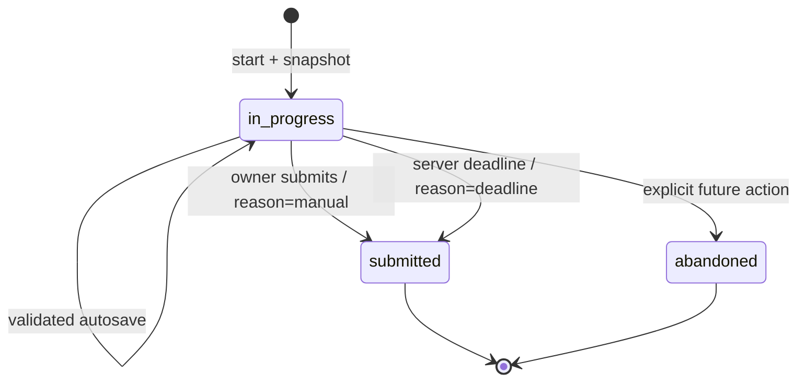

# Attempt and Exam Flow

## State model

`submitted` and future `abandoned` reject normal answer changes. Passing `expires_at` also rejects saves even before deadline finalization commits. A retry creates a new row; attempts never reset in place. `completion_reason` distinguishes a manual submission from deadline finalization without introducing an ambiguous intermediate persisted status.

## Sprint 3 shipped subset

Production ships Exercise start, resume, versioned objective-answer save, manual submit, server scoring, result breakdowns, snapshot-based History, wrong-answer Review, and the Sprint 5 mock-exam flow. Sprint 6 adds independent Writing drafts/submissions with server word counts and prompt snapshots; Sprint 7 adds independent Speaking drafts/submissions with duration, notes, self-assessment, and prompt snapshots. Neither manual practice flow claims official scoring. The implementation creates attempt and answer snapshots transactionally, rejects edits after submission or expiry, and uses `ScoringService` for supported objective types. History and Review never join live question content for their historical wording or answers.

## Sprint 6 Writing flow

1. Browse active original prompts from `/writing`.
2. Open a Task 1 or Task 2 prompt and complete the editor/self-check fields.
3. Save a draft with a server-checked optimistic `save_version`, or submit a non-empty response for practice review.
4. Store the server word count and immutable prompt snapshot; submitted responses cannot be edited.
5. Review the response and self-check without an automatic or official score.

## Sprint 7 Speaking flow

1. Browse active Part 1/2/3 prompts from `/speaking`.
2. Read the prompt and start the browser-local preparation timer.
3. Record during the speaking timer when HTTPS, permission, and browser APIs are available; otherwise continue with the prompt and notes fallback.
4. Stop, play, or download the local recording. Only duration, notes, self-assessment, and the immutable prompt snapshot are sent to the server.
5. Save a draft or submit a practice self-review; submitted rows are immutable and carry no server audio.

## Start

1. Validate authenticated owner, active target, supported items, and non-empty composition.
2. Begin database transaction.
3. Create attempt with authoritative `started_at`, target FK, optional `expires_at`, and configuration/snapshot version.
4. Load ordered live items once with contexts/options.
5. Pre-create one `attempt_answers` row per objective item, including answer key, context, positions, and maximum points. For an exam's Writing/Speaking items, pre-create the corresponding submission row with prompt snapshot and no audio.
6. Commit only when every row is valid.
7. Return the taking page without correct keys/explanations.

Pre-creating unanswered rows makes unanswered counts and historical order reliable.

## Save and autosave

Recommended MVP behavior is **save immediately on choice change**, debounced for text, plus an optional 20-30 second lightweight flush only when unsaved state exists.

Request payload contains the attempt-answer identifier, response, and last observed `save_version`. Server checks:

- attempt is in progress;
- server deadline has not passed;
- attempt-answer belongs to the attempt;
- option keys/response shape exist in the snapshot;
- version is current or request token is a duplicate.

The response increments `save_version` and returns `saved_at`. UI states are `Saving`, `Saved HH:mm:ss`, and `Not saved - retrying`. A navigation warning appears only while local changes are unsaved.

## Refresh and recovery

- Re-render from persisted responses; do not rely on browser local storage as the authority.
- Calculate remaining time from server-provided current time and `expires_at`.
- Preserve current question/page in the URL or harmless session state.
- A temporary network failure queues only the latest response for each item in memory and retries with visible status.
- Offline-first operation is out of scope.

## Timer

- Server stores `started_at` and `expires_at`; JavaScript displays a countdown against a server-time offset.
- Server validates every save and submission against its clock.
- At zero, UI disables new edits and posts finalization; if that request fails, the next server access finalizes based on stored responses/deadline.
- Multiple tabs see the same attempt. Version checks prevent stale saves; a completed-state response tells other tabs to reload.
- Timed practice can permit free navigation. Exam section navigation follows snapshotted rules.

## Submit transaction

1. Begin transaction and lock the attempt row.
2. If already submitted, return its existing result (idempotent success).
3. Re-evaluate deadline/status and load all snapshot rows.
4. Score each supported objective answer through `ScoringService`.
5. Persist correctness and awarded points.
6. Calculate total/max/percentage and counts from stored outcomes.
7. Set `submitted_at`, duration, final status, and `completion_reason` (`manual` or `deadline`).
8. Commit, then redirect to result.

Any exception rolls back all outcome and total changes. Client-provided score, correct flag, duration, or deadline is ignored.

## Expiry policy

Recommended: a deadline-passed timed attempt is automatically finalized using answers acknowledged before `expires_at`. Saves received after the deadline are rejected. It becomes `submitted` with `completion_reason=deadline` and remains viewable in history with a “submitted at deadline” note. This is simpler and more useful than an intermediate expired state or discarding the attempt.

## Results and review

Results use snapshots and show:

- target and completion time;
- points/max and percentage;
- correct, incorrect, unanswered, and ungraded counts;
- section breakdown;
- response, correct response, explanation, and context;
- link to retry or wrong-answer review.

No answer key appears before finalization. Inactive live content does not hide historical snapshots.

## Retry

Every retry starts a new attempt from the **current active target** and current question versions. The old attempt remains unchanged. UI may compare recent percentages but shall make clear that content may have changed.

## Exam-specific flow

- Snapshot exam title, `format_label`, section/item order, overall/section timing, and navigation rules.
- Show whether the exam is a VSTEP simulation or general B1 practice.
- Objective Reading/Listening items use `attempt_answers` and automatic scoring.
- Writing drafts/submissions link to the attempt and retain prompt snapshots.
- Speaking practice links metadata/self-reflection; recording remains local by default.
- A section result is `ungraded` if it contains manual tasks without a score; it is not averaged as zero.
- A simulated overall VSTEP pass/fail is not produced until a separately approved, valid manual rating workflow exists.

## Concurrency and failure cases

| Case | Handling |
|---|---|
| Double-click Start | Disable button client-side; separate committed attempts are still valid if created |
| Duplicate Submit | Row lock + status check returns existing result |
| Autosave races | Optimistic `save_version`; stale response receives conflict/current value |
| Refresh during submit | Result route waits for/reads committed state |
| Question edited mid-attempt | Snapshot remains authoritative |
| Audio file changed | Use immutable name/checksum; replace by new asset/version |
| Database error | Transaction rollback and retry-safe error |
| Server restart | Database state restores attempt; server deadline continues |
